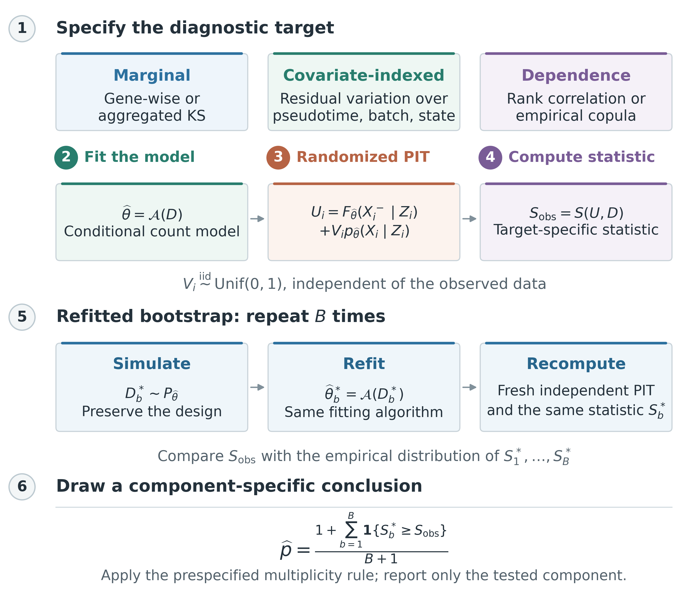

# Randomized KS Calibration

### Fitted discrete single-cell residual diagnostics

**Elvis Han Cui | Yihao Li | Zhuang Liu**

Research companion to *Randomized Kolmogorov-Smirnov Calibration for Fitted
Discrete Single-Cell Residual Diagnostics*. Code, numerical evidence, figures,
and editable manuscript sources. The manuscript is under revision; this
release is not a notice of journal acceptance.

[Manuscript](output/pdf/sibs_major_revision_manuscript.pdf) |
[Supplement](output/pdf/sibs_major_revision_supplement.pdf) |
[Versioned release](https://github.com/ElvisCuiHan/randomized-ks-calibration/releases/tag/v1.0.0) |
[Download ZIP](https://github.com/ElvisCuiHan/randomized-ks-calibration/releases/download/v1.0.0/randomized-ks-calibration-v1.0.0.zip)

---

## The Statistical Question

**When a reference distribution has been fitted to the observations being
diagnosed, which null distribution should calibrate the residual test?**

For a discrete count, the randomized residual is

$$U_i = F_{\widehat\theta}(X_i^-) + V_i p_{\widehat\theta}(X_i),
\qquad V_i \sim \mathrm{Uniform}(0,1).$$

Known margins and independent observations give uniform residuals. Reusing
the observations to fit the margins changes their joint reference law.
The fitted workflow therefore needs its own calibration, including refitting
within the bootstrap under the relevant consistency conditions.



*Figure 1. Specify the fitted workflow, construct randomized residuals,
choose the diagnostic target, calibrate the complete procedure, and report
uncertainty and multiplicity.*

The contribution is an operational synthesis and a discrete-residual
specialization of classical composite-null theory, not a new general
empirical-process theorem or a universal validation of single-cell simulators.

## Evidence at a Glance

| Analysis | Scale | What it establishes |
| :--- | :--- | :--- |
| Synthetic calibration | n = 250, 1,000, 10,000 | Comparison of known-margin, ordinary KS, fixed-parameter, and refitted references |
| Conditional scDesign3 fits | 4 scenarios; 500 outer samples each; B = 199 | **398,000 bootstrap refits**, plus 2,000 observed fits; finite-sample marginal and global between-quartile calibration |
| Pancreatic trajectory | 2,087 cells; 10 genes; B = 1,999 | **19,990 refits**, conditional on supplied pseudotime and gene selection |
| Public IMvigor210 PBMC | 24,134 retained cells; 10 genes; 2 dispersion models; B = 9,999 | **199,980 refits** of the patient-and-depth working margins |
| Lightweight feasibility | Up to 1,000,000 observations and 10 genes; 5 timing repetitions | Moment-NB computation only, not a million-cell scDesign3 bootstrap |

B is the number of bootstrap replicates for each outer sample or gene/model.
Refits are computational operations, not additional observed cells.

## Start Here

Use the release ZIP for a versioned snapshot, or clone the repository:

```bash
git clone https://github.com/ElvisCuiHan/randomized-ks-calibration.git
cd randomized-ks-calibration
git checkout v1.0.0
```

Run commands from the repository root. Start with the stored results; these
checks need neither a raw GEO download nor a new simulation:

```bash
python3 scripts/check_revision_tables.py
python3 scripts/verify_revision_results.py
Rscript scripts/verify_pancreas_results.R
Rscript scripts/verify_conditional_calibration.R
```

The checks compare printed tables with CSV sources, recalculate exceedance
counts and plus-one p-values from retained bootstrap statistics, and validate
conditional simulation summaries. Verifiers may refresh their check reports;
they do not rerun the fitting experiments.

### Build the Paper Without Rerunning Experiments

With TeX Live and `latexmk` installed:

```bash
python3 scripts/build_sibs_revision.py --public
```

This builds the clean manuscript and supplement into [output/pdf/](output/pdf/).
The public build needs no original submission, Git history, confidential
correspondence, or `latexdiff`.

## Reproduce the Analyses

Use a separate working copy for reruns: these commands update result files.
The first command **overwrites** the combined report; scGTM and scDesign3
subsequently append their sections in that order.

<details>
<summary><strong>1. Synthetic and conditional calibration</strong></summary>

```bash
python3 scripts/ks_scdesign_extended_simulations.py > results/ks_scdesign_extended_results.txt
python3 scripts/refresh_simulation_intervals.py
CONDITIONAL_OUTPUT=results/conditional_calibration_rerun CONDITIONAL_MC=500 CONDITIONAL_B=199 CONDITIONAL_WORKERS=4 Rscript scripts/ks_conditional_calibration.R
```

The conditional script resumes existing records only when their protocol
matches. The fresh output directory above performs an independent rerun while
preserving the release evidence. The paper's saved records remain in
`results/conditional_calibration/`; `scripts/write_conditional_tables.py`
generates table fragments from that canonical directory.

All four scenarios use `scDesign3::fit_marginal` with NB margins. Three use
n = 240; the spline null uses n = 2,087 with k = 5. Each bootstrap recalibrates
both the marginal KS statistic and the maximum of six scaled between-quartile
KS distances as complete statistics. Mean, NB size, and spline smoothing are
refitted where applicable.

</details>

<details>
<summary><strong>2. scGTM and scDesign3 package-data examples</strong></summary>

Obtain the [Python scGTM source](https://github.com/ElvisCuiHan/scGTM).
The recorded run used commit `f26946dbb1531e273bed54f6eb6d51c6a2a5a408`.
Set `SCGTM_SOURCE_DIR` to that local checkout.

```bash
SCGTM_SOURCE_DIR=/path/to/scGTM python3 scripts/ks_scgtm_example.py >> results/ks_scdesign_extended_results.txt
SCDESIGN3_BOOTSTRAP_B=1999 SCDESIGN3_WORKERS=4 Rscript scripts/ks_scdesign3_example.R >> results/ks_scdesign_extended_results.txt
python3 scripts/generate_summary_figures.py
```

The pancreatic analysis keeps the first ten genes in the supplied ordering
and the supplied pseudotimes fixed. It does not repeat upstream trajectory
estimation or gene selection, and does not validate the complete simulator
or copula. The scGTM count matrix is a software demonstration: its generating
mechanism has not been independently established.

</details>

<details>
<summary><strong>3. Public IMvigor210 PBMC analysis</strong></summary>

```bash
OPENBLAS_NUM_THREADS=1 OMP_NUM_THREADS=1 python3 scripts/imvigor210_residual_diagnostics.py --download --boot 9999 --models shared patient --workers 4
```

This downloads missing public per-patient count matrices, applies independent
QC, and fits shared and patient-specific dispersion margins to the fixed
ten-gene panel. Every model is refitted within its own bootstrap; Holm
adjustment is within each model's ten genes. Clinical response labels are
descriptive, and fitted log scores are in-sample summaries.

</details>

<details>
<summary><strong>4. Computational summaries and focused tests</strong></summary>

```bash
python3 scripts/report_computational_costs.py
python3 scripts/test_simulation_intervals.py
python3 scripts/test_imvigor210_bootstrap.py
Rscript scripts/test_yl_bootstrap.R
Rscript scripts/test_conditional_calibration.R
```

The reporting command regenerates computational tables from stored timers.
To remeasure only the lightweight moment-NB experiment, first update
`results/computational_reporting/hardware_inventory.json` for the actual host:

```bash
OPENBLAS_NUM_THREADS=1 OMP_NUM_THREADS=1 python3 scripts/report_computational_costs.py --benchmark
```

This runs five sequential repetitions after a small warm-up; it does not
rerun the statistical calibration experiments. Historical synthetic rejection
counts are retained; their reported intervals are Wilson intervals. The new
conditional experiments use Clopper-Pearson intervals.

</details>

## Results and File Guide

| Location | Contents |
| :--- | :--- |
| [Main source](ks_scdesign_sib.tex) | Manuscript LaTeX |
| [Supplement source](supplementary-appendix.tex) | Proofs, extended analyses, implementation and timing details |
| [Figures](figs/) | Publication figures; Figure 1 has PDF, editable SVG, and PNG versions |
| [Conditional calibration](results/conditional_calibration/) | Protocol, 2,000 outer-trial records, reference statistics and summaries |
| [scDesign3 examples](results/scdesign3_example/) | Pancreatic bootstrap records and embryo provenance checks |
| [IMvigor210](results/genentech_imvigor210/) | Source hashes, QC, both dispersion models and reference statistics |
| [scGTM example](results/scgtm_example/) | Gene-level and aggregate demonstration summaries |
| [Computational reporting](results/computational_reporting/) | Hardware inventory, task timers and all 20 lightweight measurements |
| [Synthetic counts](results/synthetic_rejection_counts.csv) | Canonical rejection counts and intervals |
| [Combined report](results/ks_scdesign_extended_results.txt) | Numerical report, including explicitly historical timing blocks |
| [Scripts](scripts/) | Analyses, figure generation, table verification and builds |

`scripts/ks_crossing_calculations.py` and
`scripts/ks_composite_simulation.py` provide the additional crossing and
composite-null calculations. The public release includes a per-file SHA-256
manifest in `reproducibility/sha256.json`.

## Environment and Runtime

| Component | Recorded environment |
| :--- | :--- |
| Host | Apple M1 Max; 10 CPU cores (8 performance + 2 efficiency); 64 GiB RAM |
| Operating system | macOS 26.5.2, arm64 |
| Python | 3.12.4; NumPy 1.26.4; SciPy 1.13.1; pandas 2.2.2; Matplotlib 3.8.4 |
| R | 4.5.3; scDesign3 1.8.0; mgcv 1.9-4; SingleCellExperiment 1.32.0; gamlss.dist 6.1.1 |
| Optional example dependency | PySwarms 1.3.0 and the pinned Python scGTM source |
| Document build | TeX Live with `latexmk`; `latexdiff` only for the private marked build |

The Python figure scripts also use Pillow. These are recorded versions, not
a lockfile or a claim that every other version has been tested. Full,
run-specific records are in the [combined environment log](results/reproducibility_session_info.txt)
and [conditional R session](results/conditional_calibration/session_info.txt).

**Measured conditional workload:** 2,000 observed fits plus 398,000 bootstrap
refits completed in **3,122.590 seconds (52.04 minutes)** with four workers,
excluding initial package loading. Individual task timers overlap and cannot
be summed into total wall time or CPU time. Spline tasks contain long
elapsed-time outliers of unrecorded cause.

**Million-observation timing:** the lightweight G = 10 experiment has median
observed-stage and single-refit times of approximately **2.01 s** and **1.99 s**.
The **6.64-minute** total for B = 199 is a serial projection, not a measured
199-refit run. Its array-memory estimate is analytic, not peak RSS; 64 GiB is
installed hardware capacity. No GPU, CPU-affinity or parallel-speedup
benchmark is claimed. See Supplement H.6 for each timer's boundaries.

## Public Data and Interpretation

| Source | Use and provenance |
| :--- | :--- |
| R `InsectSprays` | Small grouped-count illustration |
| [GSE132188](https://www.ncbi.nlm.nih.gov/geo/query/acc.cgi?acc=GSE132188) | scDesign3 pancreatic subset: 2,087 cells and 100 available genes; ten genes are diagnosed |
| [E-MTAB-3929](https://www.ebi.ac.uk/biostudies/arrayexpress/studies/E-MTAB-3929) | scDesign3 embryo subset: 1,289 cells and ten genes; cell identifiers and five embryonic-day labels verified |
| [GSE145281](https://www.ncbi.nlm.nih.gov/geo/query/acc.cgi?acc=GSE145281) | Ten public baseline-PBMC matrices; 24,134 of 26,749 candidate cells retained after QC; trial context [NCT02108652](https://clinicaltrials.gov/study/NCT02108652) |
| [scGTM demonstration](https://github.com/ElvisCuiHan/scGTM) | Distributed count/pseudotime example, not independently verified biological data or a verified simulation null |

Raw GEO downloads are not redistributed here. Scripts retrieve them from
their original public sources and retain source URLs, sizes and hashes.
Embryo preprocessing and pseudotime estimation were not reconstructed.
The IMvigor210 analysis uses no proprietary Genentech data and makes no
treatment-efficacy or clinical-response association claim.

Separate marginal KS tests do not diagnose copula-only errors. Fixed-design
calibration evidence does not establish universal bootstrap consistency.
The covariance-based Gaussian alternative is described analytically but has
not been numerically benchmarked against bootstrap computation.

## Citation and Reuse

Please cite the manuscript and identify the release used; publication
metadata will be updated after an editorial decision. Machine-readable
metadata are provided in [CITATION.cff](CITATION.cff).

```bibtex
@misc{cui2026randomizedks,
  author = {Cui, Elvis Han and Li, Yihao and Liu, Zhuang},
  title = {Randomized Kolmogorov-Smirnov Calibration for Fitted Discrete Single-Cell Residual Diagnostics},
  year = {2026},
  howpublished = {Research manuscript and reproducibility materials, version 1.0.0},
  url = {https://github.com/ElvisCuiHan/randomized-ks-calibration}
}
```

The original template's license notice is preserved in [LICENSE](LICENSE).
See [NOTICE.md](NOTICE.md) for its scope and third-party materials. Public
availability does not replace the original data and software usage terms.
Questions about the analyses can be raised through
[GitHub Issues](https://github.com/ElvisCuiHan/randomized-ks-calibration/issues).

<details>
<summary><strong>Journal submission files and private build</strong></summary>

The authors' working directory also contains the marked manuscript,
point-by-point response and the separate `Online_Resource_1.zip` submission
bundle. With the private response and original baseline available:

```bash
python3 scripts/build_sibs_revision.py
python3 scripts/package_revision.py
```

Confidential editorial correspondence, reviewer reports, marked changes,
internal audits and original submission history are excluded from the
public repository and release. The public archive and the journal
submission bundle are deliberately different artifacts.

</details>
